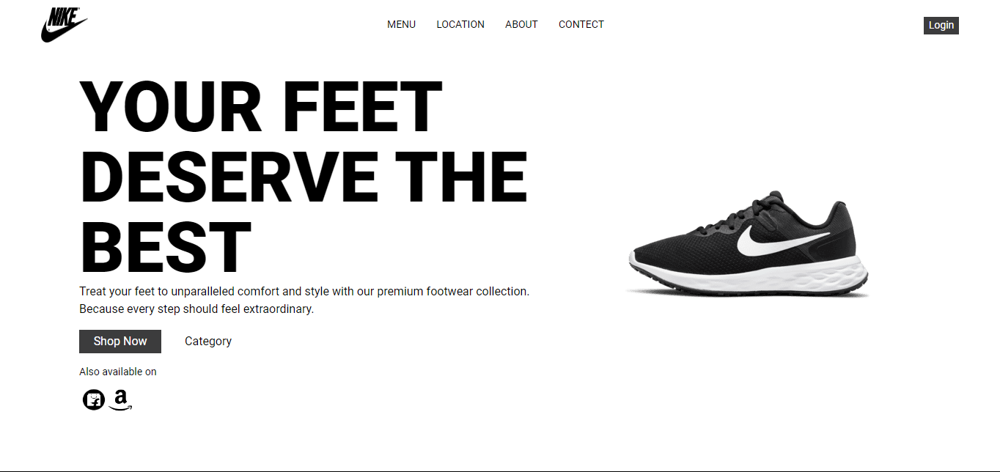

# Nike Landing Page

This project is a landing page for Nike, built using React and Tailwind CSS.



## Table of Contents

- [Demo](#demo)
- [Features](#features)
- [Technologies](#technologies)
- [Installation](#installation)
- [Usage](#usage)
- [Contributing](#contributing)
- [License](#license)

## Demo

Check out the live demo [here](https://mohdamirwebdeveloper.github.io/Nike_Landing_page/).

## Features

- Responsive design
- Modern UI/UX
- Interactive components

## Technologies

- React
- Tailwind CSS

## Installation

1. Clone the repository:

   ```bash
[   git clone https://github.com/your-username/nike-landing-page.git
](https://github.com/mohdamirwebdeveloper/Nike_Landing_page.git)   
cd nike-landing-page
